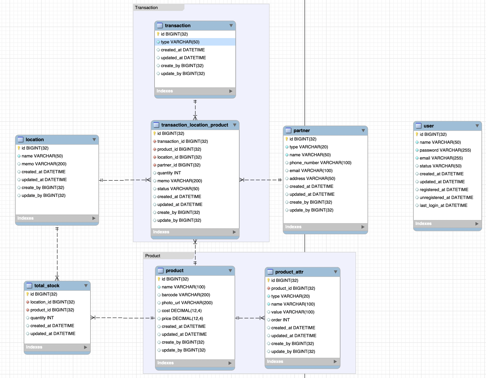

# Database 설계

## DB 스펙&#x20;

* mysql 8.0

## 설계 중점 고려 사항

## 파트별 테이블 설계

### 재고 관리 파트

<figure><figcaption>
v 1.0
</figcaption></figure>

#### 내용

* 거래(출고, 입고 등) 이력을 한 테이블에서 관리. 별도의 재고 테이블 없음.

#### 추가 고려 사항

* 재고 파악하고 보여주는 부분과 거래(출고, 입고 등) 이력을 저장하는 방식에 대한 고민이 필요
  * 현재 방식은 재고와 거래(출고, 입고 등) 이력을 별도로 구분하지 않고 같이 관리하면서 수량 계산을 통해 재고를 파악하는 방식.
  * 구현이 쉽고, 규모가 작거나, 저장량이 적은 경우에는 큰 문제가 되지 않을 수 있으나, 점차 데이터의 양이 늘어남에 따라 재고를 파악하는 비용도 같이 증가하는 구조.
* 별도의 재고 테이블을 두어 재고파악과 거래(출고, 입고 등) 이력을 분리하는 방법.
  * 현재 상태를 반영해야하는 성격의 테이블과, 이력관리가 필요한 성격의 테이블을 분리한다.&#x20;
  * 거래 변경사항이 발생할 때 재고를 변경시킨다면, 재고 파악시 데이터가 늘어나더라도 위 구조보다는 좋은 성능으로  조회가 가능. (-데이터 공간)
* 거래 이력도 출고/입고/이동 등 분리하는 것도 고민해볼 것.

***

<figure><figcaption>
v1.1 
</figcaption></figure>

#### 변경사항

* 재고 테이블 추가
* 각 테이블마다 생성자, 수정자 필드 추가(유저 테이블 추가)

### 주문 파트

### 유저 파트

